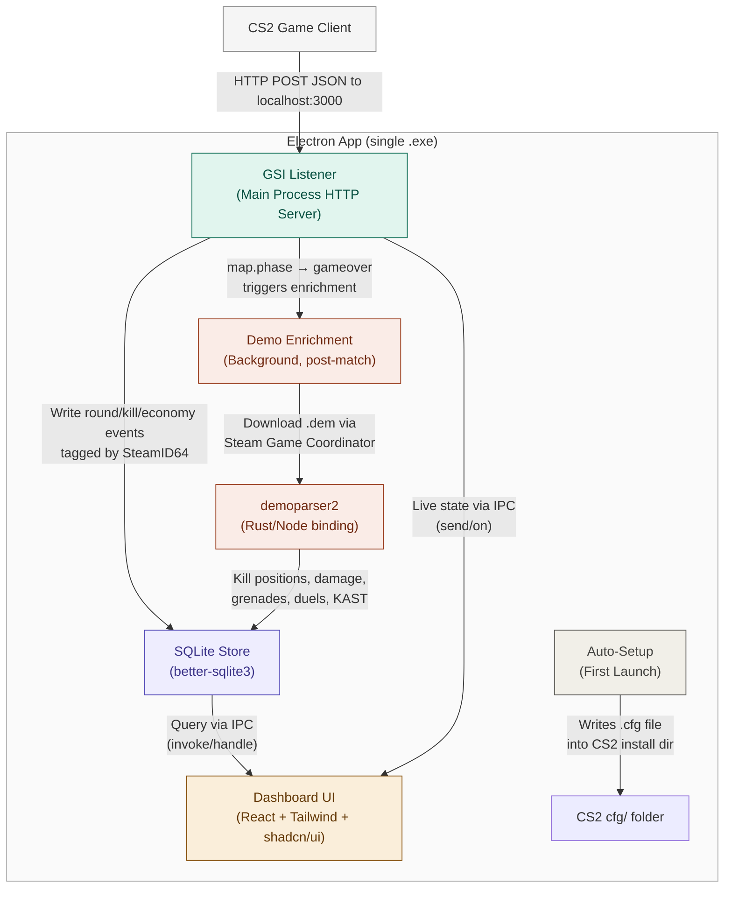

# CS2 Companion App — Project Specification

## Overview

A local-first desktop companion app for Counter-Strike 2 that captures live game data via Valve's Game State Integration (GSI), enriches it with post-match demo parsing, stores everything in SQLite, and displays it in a polished dashboard UI focused on helping players identify areas to improve. Designed to be handed to a non-technical friend as a single Windows installer — they run it, launch CS2, and stats start appearing automatically.

---

## Architecture

```
┌─────────────────────────────────────────────────────────────────┐
│  CS2 Game Client                                                │
│  Sends HTTP POST to localhost:3000 via GSI config               │
└──────────────────────────┬──────────────────────────────────────┘
                           │ JSON payloads (push-based, not polled)
                           ▼
┌─────────────────────────────────────────────────────────────────┐
│  Electron App (single process, single .exe installer)           │
│                                                                 │
│  ┌──────────────────┐  ┌──────────────────┐  ┌───────────────┐ │
│  │  GSI Listener     │  │  SQLite Store     │  │  Dashboard UI │ │
│  │  (Main Process)   │──│  (Main Process)   │──│  (Renderer)   │ │
│  │                   │  │                   │  │               │ │
│  │  - HTTP server on │  │  - better-sqlite3 │  │  - React 18+  │ │
│  │    localhost:3000  │  │  - one .db file   │  │  - Tailwind   │ │
│  │  - Parses GSI JSON│  │  - tagged by      │  │  - shadcn/ui  │ │
│  │  - Validates auth │  │    SteamID64 from  │  │  - Recharts   │ │
│  │    token           │  │    GSI payload     │  │    for charts │ │
│  │  - Emits events   │  │  - round events,   │  │               │ │
│  │    to store + UI  │  │    kills, economy, │  │               │ │
│  │                   │  │    weapon stats    │  │               │ │
│  └──────────────────┘  └──────────────────┘  └───────────────┘ │
│                                │ ▲                               │
│  ┌─────────────────────────────┼─┘                              │
│  │  Demo Enrichment Pipeline   │                                │
│  │  (Main Process, background) │                                │
│  │                             │                                │
│  │  - Triggered on match end (GSI map.phase → gameover)         │
│  │  - Downloads .dem via Steam Game Coordinator                 │
│  │  - Parses with demoparser2 (Node.js binding, Rust core)     │
│  │  - Extracts: kill positions, damage events, grenade usage,  │
│  │    opening duels, trade kills, crosshair placement, KAST    │
│  │  - Merges enriched data into existing match record in SQLite │
│  │  - Deletes raw .dem file after parsing                      │
│  └──────────────────────────────────────────────────────────────┘│
│                                                                 │
│  ┌──────────────────────────────────────────────────────────────┐│
│  │  Auto-Setup (First Launch)                                   ││
│  │  - Finds CS2 install via Windows registry                    ││
│  │    (HKCU\Software\Valve\Steam → SteamPath)                   ││
│  │  - Writes gamestate_integration_companion.cfg into           ││
│  │    <CS2>/game/csgo/cfg/                                      ││
│  │  - Generates a random auth token, stores it locally          ││
│  │  - Profile = SteamID64 from GSI payload (no login needed)    ││
│  └──────────────────────────────────────────────────────────────┘│
└─────────────────────────────────────────────────────────────────┘
```



---

## Tech Stack & Rationale

| Layer | Choice | Why |
|-------|--------|-----|
| Desktop shell | **Electron** | Single .exe installer via electron-builder. Owns its own window (no "open browser to localhost" UX). Handles tray icon, lifecycle, notifications out of the box. Heavier than alternatives (~150MB) but irrelevant for a tool that runs alongside a game. |
| UI framework | **React 18+** | Largest ecosystem, required by shadcn/ui. |
| Styling | **Tailwind CSS** | Pixel-level control via utility classes. No fighting pre-built CSS opinions. |
| Components | **shadcn/ui** | Copies real source into your project (not an opaque npm package). Beautiful dark-mode defaults. Fully customizable. |
| Charts | **Recharts** | React-native charting, composable, works well with Tailwind/shadcn aesthetic. |
| Database | **better-sqlite3** | Synchronous, fast, zero-config. Single .db file per installation. No server. |
| GSI listener | **Node.js http module** | Built into Node (which Electron includes). Just an HTTP server parsing JSON. |
| Packaging | **electron-builder** | Produces NSIS installer for Windows (.exe). Auto-update support if needed later. |
| Build tool | **Vite** | Fast HMR for React dev. electron-vite or vite with electron-plugin. |
| Demo parser | **@laihoe/demoparser2** | Rust core with Node.js binding. Parses a full match in ~1 second. Query-style API (not streaming), returns DataFrames of events + tick data. |
| Demo download | **node-globaloffensive** + **steam-user** | Communicates with Steam Game Coordinator to fetch match share codes and download .dem files. Requires Steam client to be running. |

---

## Target Platform

- **Ship:** Windows only (.exe installer)
- **Develop:** macOS is fine for all UI work, GSI listener logic, and SQLite layer. The only Windows-specific code is the auto-setup module (registry lookup + cfg file writing). Test that on a Windows VM or a friend's machine.
- Windows-specific code should be isolated behind a platform check so the rest of the app runs on macOS during development.

---

## Folder Structure

```
cs2-companion/
├── package.json
├── electron-builder.yml          # Installer config (NSIS, app icon, etc.)
├── vite.config.ts                # Vite config for React renderer
├── tailwind.config.ts
├── tsconfig.json
│
├── src/
│   ├── main/                     # Electron main process
│   │   ├── index.ts              # App entry: creates window, starts GSI server
│   │   ├── gsi-server.ts         # HTTP server on localhost:3000, parses GSI JSON
│   │   ├── gsi-types.ts          # TypeScript types for GSI payload
│   │   ├── database.ts           # better-sqlite3 wrapper, schema, queries
│   │   ├── ipc-handlers.ts       # IPC handlers exposed to renderer via invoke/handle
│   │   ├── auto-setup.ts         # Windows registry lookup, .cfg file writer
│   │   ├── tray.ts               # System tray icon + menu
│   │   └── demo/                 # Post-match demo enrichment pipeline
│   │       ├── demo-manager.ts   # Orchestrates: detect match end → download → parse → store
│   │       ├── demo-downloader.ts # Steam Game Coordinator integration (steam-user + node-globaloffensive)
│   │       ├── demo-parser.ts    # demoparser2 wrapper, extracts events + tick data
│   │       ├── demo-analyzer.ts  # Computes improvement metrics from parsed data
│   │       └── demo-types.ts     # Types for parsed demo data
│   │
│   ├── preload/
│   │   └── index.ts              # contextBridge exposing safe IPC to renderer
│   │
│   ├── renderer/                 # React app (Vite-built)
│   │   ├── index.html
│   │   ├── main.tsx              # React entry
│   │   ├── App.tsx               # Root layout, routing
│   │   ├── components/
│   │   │   ├── ui/               # shadcn/ui components (Button, Card, etc.)
│   │   │   ├── LivePanel.tsx     # Real-time HP, armor, money, round phase
│   │   │   ├── MatchHistory.tsx  # Past matches list with expandable details
│   │   │   ├── StatsOverview.tsx # Aggregated stats: K/D, HS%, win rate, KAST
│   │   │   ├── EconomyChart.tsx  # Money/equipment value over rounds (Recharts)
│   │   │   ├── WeaponBreakdown.tsx  # Per-weapon kill/accuracy stats
│   │   │   ├── MapPerformance.tsx   # Win rate and stats per map
│   │   │   ├── ImprovementDash.tsx  # Top 3 weakest areas, trend indicators
│   │   │   ├── DeathHeatmap.tsx     # Map overlay of death positions
│   │   │   ├── OpeningDuels.tsx     # Opening duel win/loss per map/side
│   │   │   ├── UtilityReport.tsx    # Grenade usage and effectiveness trends
│   │   │   └── RoundTimeline.tsx    # Horizontal round-by-round contribution view
│   │   ├── hooks/
│   │   │   ├── useGSI.ts         # Subscribes to live GSI events via IPC
│   │   │   └── useStats.ts       # Queries historical data via IPC invoke
│   │   ├── lib/
│   │   │   └── utils.ts          # Tailwind cn() helper, formatters
│   │   └── styles/
│   │       └── globals.css       # Tailwind directives, shadcn theme vars
│   │
│   └── shared/
│       └── types.ts              # Types shared between main and renderer
│
├── resources/
│   ├── icon.ico                  # App icon (Windows)
│   ├── icon.png                  # App icon (dev/macOS)
│   └── tray-icon.png             # System tray icon (16x16 or 32x32)
│
└── scripts/
    └── generate-gsi-config.ts    # Utility to generate the .cfg for testing
```

---

## GSI Configuration (auto-generated on first launch)

The app writes this file to `<CS2 install>/game/csgo/cfg/gamestate_integration_companion.cfg`:

```
"CS2 Companion"
{
    "uri"           "http://127.0.0.1:3000"
    "timeout"       "5.0"
    "buffer"        "0.1"
    "throttle"      "0.5"
    "heartbeat"     "30.0"
    "auth"
    {
        "token"     "<randomly-generated-token>"
    }
    "data"
    {
        "provider"              "1"
        "map"                   "1"
        "round"                 "1"
        "player_id"             "1"
        "player_state"          "1"
        "player_weapons"        "1"
        "player_match_stats"    "1"
        "map_round_wins"        "1"
    }
}
```

The auth token is generated once and stored alongside the SQLite database. The GSI listener validates it on every incoming request.

---

## SQLite Schema (starting point)

```sql
-- Matches
CREATE TABLE matches (
    id              INTEGER PRIMARY KEY AUTOINCREMENT,
    steam_id        TEXT NOT NULL,           -- SteamID64 from GSI provider block
    map             TEXT NOT NULL,
    mode            TEXT,                     -- competitive, casual, etc.
    started_at      DATETIME DEFAULT CURRENT_TIMESTAMP,
    ended_at        DATETIME,
    ct_score        INTEGER DEFAULT 0,
    t_score         INTEGER DEFAULT 0,
    result          TEXT,                     -- win, loss, draw, in_progress
    demo_parsed     BOOLEAN DEFAULT 0,       -- whether demo enrichment has run
    share_code      TEXT                      -- for re-downloading if needed
);

-- Round-level snapshots (GSI-populated initially, enriched by demo)
CREATE TABLE rounds (
    id              INTEGER PRIMARY KEY AUTOINCREMENT,
    match_id        INTEGER REFERENCES matches(id),
    round_number    INTEGER NOT NULL,
    phase           TEXT,                     -- freezetime, live, over
    side            TEXT,                     -- CT or T
    won             BOOLEAN,
    win_condition   TEXT,                     -- elimination, bomb_defused, bomb_exploded, time
    money_start     INTEGER,
    equipment_value INTEGER,
    kills           INTEGER DEFAULT 0,
    deaths          INTEGER DEFAULT 0,
    assists         INTEGER DEFAULT 0,
    headshots       INTEGER DEFAULT 0,
    -- Demo-enriched fields (NULL until demo is parsed)
    adr             REAL,                     -- average damage this round
    kast            BOOLEAN,                  -- did player get a Kill, Assist, Survive, or get Traded
    opening_duel    TEXT,                     -- 'won', 'lost', or NULL if not in opening duel
    survived        BOOLEAN,
    clutch_situation TEXT,                    -- '1v1', '1v2', etc. or NULL
    clutch_won      BOOLEAN
);

-- Kill events (GSI gives basic kills; demo adds positions + context)
CREATE TABLE kill_events (
    id              INTEGER PRIMARY KEY AUTOINCREMENT,
    round_id        INTEGER REFERENCES rounds(id),
    match_id        INTEGER REFERENCES matches(id),
    tick            INTEGER,                  -- demo tick (NULL if GSI-only)
    weapon          TEXT NOT NULL,
    headshot        BOOLEAN DEFAULT 0,
    wallbang        BOOLEAN DEFAULT 0,       -- demo-enriched
    through_smoke   BOOLEAN DEFAULT 0,       -- demo-enriched
    attacker_blinded BOOLEAN DEFAULT 0,      -- demo-enriched: attacker was flashed
    is_trade        BOOLEAN DEFAULT 0,       -- demo-enriched: trade kill (within 5s)
    is_opening      BOOLEAN DEFAULT 0,       -- demo-enriched: first kill of the round
    -- Positions (demo-enriched, NULL if GSI-only)
    attacker_x      REAL,
    attacker_y      REAL,
    attacker_z      REAL,
    victim_x        REAL,
    victim_y        REAL,
    victim_z        REAL,
    attacker_area   TEXT,                     -- named map area (e.g. "MidDoors", "BombsiteA")
    victim_area     TEXT,
    timestamp       DATETIME DEFAULT CURRENT_TIMESTAMP
);

-- Damage events (demo-only, per-hit granularity)
CREATE TABLE damage_events (
    id              INTEGER PRIMARY KEY AUTOINCREMENT,
    round_id        INTEGER REFERENCES rounds(id),
    match_id        INTEGER REFERENCES matches(id),
    tick            INTEGER,
    weapon          TEXT NOT NULL,
    damage          INTEGER,                  -- HP removed
    damage_armor    INTEGER,                  -- armor damage
    hitgroup        TEXT,                      -- head, chest, stomach, left_arm, right_arm, left_leg, right_leg
    attacker_id     TEXT,                      -- SteamID64
    victim_id       TEXT
);

-- Grenade events (demo-only, for utility analysis)
CREATE TABLE grenade_events (
    id              INTEGER PRIMARY KEY AUTOINCREMENT,
    round_id        INTEGER REFERENCES rounds(id),
    match_id        INTEGER REFERENCES matches(id),
    tick            INTEGER,
    thrower_id      TEXT,                      -- SteamID64
    grenade_type    TEXT,                      -- smoke, flashbang, he_grenade, molotov, incendiary, decoy
    throw_x         REAL,
    throw_y         REAL,
    throw_z         REAL,
    land_x          REAL,
    land_y          REAL,
    land_z          REAL,
    -- Effectiveness (computed during enrichment)
    enemies_flashed INTEGER DEFAULT 0,        -- for flashbangs: how many enemies were blinded
    teammates_flashed INTEGER DEFAULT 0,      -- friendly flashes (improvement signal!)
    damage_dealt    INTEGER DEFAULT 0         -- for HE/molotov: total damage caused
);

-- Death positions (demo-only, for heatmap generation)
-- Separate table because we want fast spatial queries
CREATE TABLE death_positions (
    id              INTEGER PRIMARY KEY AUTOINCREMENT,
    match_id        INTEGER REFERENCES matches(id),
    round_id        INTEGER REFERENCES rounds(id),
    map             TEXT NOT NULL,
    x               REAL NOT NULL,
    y               REAL NOT NULL,
    z               REAL,
    area_name       TEXT,                      -- named area for grouping
    side            TEXT,                       -- CT or T when died
    died_to_weapon  TEXT,
    was_headshot    BOOLEAN DEFAULT 0
);

-- Per-match aggregated improvement metrics (computed after demo parse)
CREATE TABLE match_improvement_stats (
    id              INTEGER PRIMARY KEY AUTOINCREMENT,
    match_id        INTEGER UNIQUE REFERENCES matches(id),
    steam_id        TEXT NOT NULL,
    -- Aim
    headshot_pct    REAL,                      -- kills that were headshots
    shots_fired     INTEGER,
    shots_hit       INTEGER,
    accuracy_pct    REAL,
    -- Duels
    opening_duels_taken INTEGER DEFAULT 0,
    opening_duels_won   INTEGER DEFAULT 0,
    opening_duel_pct    REAL,
    -- Trades
    trade_kills     INTEGER DEFAULT 0,
    times_traded    INTEGER DEFAULT 0,         -- how often teammates traded your death
    -- Utility
    flashes_thrown  INTEGER DEFAULT 0,
    enemies_flashed_total INTEGER DEFAULT 0,
    teammates_flashed_total INTEGER DEFAULT 0, -- lower is better
    smokes_thrown   INTEGER DEFAULT 0,
    molos_thrown    INTEGER DEFAULT 0,
    he_thrown       INTEGER DEFAULT 0,
    utility_damage  INTEGER DEFAULT 0,
    -- Economy
    avg_money_unspent_on_loss INTEGER,         -- money wasted on lost rounds
    eco_round_kills INTEGER DEFAULT 0,         -- kills during eco/force rounds
    -- Survival & Impact
    kast_pct        REAL,                      -- % of rounds with Kill/Assist/Survive/Trade
    adr             REAL,                      -- average damage per round
    clutch_attempts INTEGER DEFAULT 0,
    clutch_wins     INTEGER DEFAULT 0,
    avg_death_time  REAL                       -- avg seconds into round when dying (early = overaggressive?)
);

-- Indexes
CREATE INDEX idx_matches_steam ON matches(steam_id);
CREATE INDEX idx_rounds_match ON rounds(match_id);
CREATE INDEX idx_kills_round ON kill_events(round_id);
CREATE INDEX idx_kills_match ON kill_events(match_id);
CREATE INDEX idx_damage_round ON damage_events(round_id);
CREATE INDEX idx_grenades_round ON grenade_events(round_id);
CREATE INDEX idx_deaths_map ON death_positions(map);
CREATE INDEX idx_improvement_steam ON match_improvement_stats(steam_id);
```

---

## IPC Contract (Main ↔ Renderer)

Communication between Electron's main process and the React renderer uses contextBridge + ipcRenderer/ipcMain.

### Main → Renderer (push, for live data)
```typescript
// Main process sends:
mainWindow.webContents.send('gsi:state', currentGameState);
mainWindow.webContents.send('gsi:round-end', roundSummary);
mainWindow.webContents.send('gsi:match-end', matchSummary);
mainWindow.webContents.send('demo:enrichment-complete', matchId);  // demo parsed, new data ready
mainWindow.webContents.send('demo:enrichment-progress', { matchId, stage: 'downloading' | 'parsing' | 'analyzing' });

// Renderer listens:
window.electronAPI.onGSIState((state) => { /* update live panel */ });
window.electronAPI.onRoundEnd((summary) => { /* flash notification */ });
window.electronAPI.onDemoReady((matchId) => { /* refresh match detail with enriched data */ });
```

### Renderer → Main (request/response, for historical queries)
```typescript
// Renderer invokes:
const matches = await window.electronAPI.getMatches(steamId, limit);
const stats = await window.electronAPI.getAggregateStats(steamId);
const weaponStats = await window.electronAPI.getWeaponBreakdown(steamId);
const mapStats = await window.electronAPI.getMapPerformance(steamId);

// Demo-enriched queries:
const improvement = await window.electronAPI.getImprovementStats(steamId, lastNMatches);
const deathPositions = await window.electronAPI.getDeathPositions(steamId, map);
const openingDuels = await window.electronAPI.getOpeningDuelStats(steamId, map?);
const utilityStats = await window.electronAPI.getUtilityStats(steamId, lastNMatches);
const roundTimeline = await window.electronAPI.getRoundTimeline(matchId);
const trends = await window.electronAPI.getStatTrends(steamId, metric, windowSize);

// Main handles:
ipcMain.handle('get-matches', (event, steamId, limit) => db.getMatches(steamId, limit));
ipcMain.handle('get-aggregate-stats', (event, steamId) => db.getAggregateStats(steamId));
ipcMain.handle('get-improvement-stats', (event, steamId, n) => db.getImprovementStats(steamId, n));
ipcMain.handle('get-death-positions', (event, steamId, map) => db.getDeathPositions(steamId, map));
```

---

## GSI Payload — Key Fields Reference

When playing (not spectating), CS2 sends these fields:

```jsonc
{
  "provider": {
    "steamid": "76561198012345678",   // <-- This IS the user profile. No login needed.
    "timestamp": 1719500000
  },
  "map": {
    "name": "de_dust2",
    "mode": "competitive",
    "phase": "live",                   // warmup, live, gameover, intermission
    "round": 12,
    "team_ct": { "score": 7 },
    "team_t": { "score": 5 }
  },
  "round": {
    "phase": "live",                   // freezetime, live, over
    "win_team": "CT",                  // only when phase=over
    "bomb": "planted"                  // planted, defused, exploded (when applicable)
  },
  "player": {
    "steamid": "76561198012345678",
    "team": "CT",
    "state": {
      "health": 100,
      "armor": 100,
      "helmet": true,
      "money": 4750,
      "equip_value": 4400,
      "round_kills": 2,
      "round_killhs": 1,
      "round_totaldmg": 180
    },
    "weapons": {
      "weapon_0": { "name": "weapon_knife", "type": "Knife", "state": "holstered" },
      "weapon_1": { "name": "weapon_ak47", "type": "Rifle", "state": "active", "ammo_clip": 25, "ammo_reserve": 90 },
      "weapon_2": { "name": "weapon_glock", "type": "Pistol", "state": "holstered" }
    },
    "match_stats": {
      "kills": 15,
      "assists": 3,
      "deaths": 8,
      "mvps": 2,
      "score": 35
    }
  },
  "previously": { /* delta of what changed since last payload */ },
  "added": { /* fields that are new since last payload */ }
}
```

### Important GSI Behaviors
- **Push-based, not polling.** CS2 sends data to your server; you don't request it.
- **Delta-aware.** The `previously` and `added` blocks tell you what changed. Full state is always in the top-level keys.
- **Role-restricted.** While playing, you only get YOUR data. Fields like `allplayers_position` only populate when spectating/GOTV (anti-cheat by design).
- **Auth token** is included in every payload under `auth.token`. Validate it.
- **Throttle/buffer** control update frequency. 0.5s throttle is a good balance for a stats app — responsive enough without being wasteful.

---

## Post-Match Demo Enrichment

GSI provides good live data, but improvement analysis requires the demo file. After a match ends, the app automatically downloads and parses the .dem file to fill in everything GSI can't provide.

### What the demo adds beyond GSI

| Category | GSI gives you | Demo adds |
|----------|---------------|-----------|
| Kills | count, weapon, headshot (yours only) | XYZ positions of attacker + victim, wallbang, through-smoke, flash-assist, trade kill detection, opening duel flag, named map area |
| Damage | round total only | Per-hit: weapon, damage, armor damage, hitgroup (head/chest/legs), attacker + victim IDs |
| Grenades | nothing (spectator-only in GSI) | Every throw: type, thrower, throw + landing positions, enemies/teammates flashed, damage dealt |
| Positions | nothing (spectator-only in GSI) | Tick-by-tick XYZ + view angles for ALL players at 64 ticks/sec |
| Deaths | count only | XYZ position, area name, time-into-round, weapon, headshot — enables heatmaps |
| Rounds | win/loss, side, win condition | KAST per round, clutch situations, opening duel outcomes, time-of-death |
| Weapon fires | nothing | Every shot fired: tick, weapon, position — enables accuracy calculation |

### Data sources available post-match

**Source 1: Steam Game Coordinator (match list + demo download)**
Accessed via node-globaloffensive + steam-user libraries. Requires Steam client to be running. Returns the last 8 matchmaking matches as share codes. Each share code resolves to a downloadable .dem.gz file hosted on Valve's servers (URL is temporary, ~7 day expiry). The Game Coordinator uses Steam's internal protobuf messaging, not a REST API.

**Source 2: Demo file (.dem) parsing**
Use @laihoe/demoparser2 (Node.js binding over Rust core). Query-style API — you ask for specific events or tick data rather than streaming through the file. A full competitive match parses in ~1 second. Raw .dem files are 100-500MB; delete after parsing.

Available event queries via demoparser2:
- `parser.parse_event("player_death")` — all kills with attacker, victim, weapon, headshot, wallbang, penetrated, thrusmoke, attackerblind, assister, assistedflash, positions
- `parser.parse_event("player_hurt")` — all damage instances with hitgroup, damage, weapon
- `parser.parse_event("weapon_fire")` — every shot fired
- `parser.parse_event("flashbang_detonate")` — flash events (combine with player state to count blinded enemies)
- `parser.parse_event("smokegrenade_detonate")` — smoke positions
- `parser.parse_event("hegrenade_detonate")` — HE positions
- `parser.parse_event("inferno_startburn")` — molotov/incendiary fire positions
- `parser.parse_event("bomb_planted")` / `"bomb_defused"` — bomb events with positions
- `parser.parse_event("round_start")` / `"round_end"` — round boundaries

Available tick queries:
- `parser.parse_ticks(["X", "Y", "Z", "health", "armor_value", "active_weapon_name", "is_scoped", "flash_duration", "pitch", "yaw"])` — player state at every tick (or sampled ticks)
- Tick data can be filtered to specific players, rounds, or tick ranges

**Source 3: Steam Web API (supplementary)**
Basic account-level stats via `ISteamUserStats/GetUserStatsForGame`. Limited and not per-match, but can provide lifetime totals like total_kills, total_headshots, total_wins as a sanity check.

### Enrichment pipeline flow

```
1. GSI detects map.phase transition to "gameover"
2. Wait ~60 seconds (demo takes time to finalize on Valve's servers)
3. Connect to Steam Game Coordinator via steam-user
4. Fetch recent match list, find the match by map + timestamp correlation
5. Download .dem.gz, decompress to .dem in a temp directory
6. Parse with demoparser2:
   a. Extract all kill events with positions and context flags
   b. Extract all damage events with hitgroups
   c. Extract all grenade events with positions and effectiveness
   d. Extract death positions for the player's SteamID
   e. Compute opening duel outcomes per round
   f. Compute trade kills (kill within 5 seconds of a teammate's death)
   g. Compute KAST per round
   h. Compute clutch situations (1vN where player was last alive)
   i. Count weapon fires for accuracy calculation
   j. Compute average time-of-death per round
7. Write enriched data to SQLite (kill_events, damage_events, grenade_events,
   death_positions, match_improvement_stats)
8. Set matches.demo_parsed = 1
9. Delete temp .dem file
10. Notify renderer via IPC that enriched data is ready
```

### Improvement metrics explained

These are the stats that actually tell a player where to improve, computed from demo data:

**Opening duel win rate** — % of first-kills-of-the-round where the player won. Low rate + high participation = taking bad fights. Low participation = not creating space for the team.

**Trade kill rate** — how often you trade a teammate's death within 5 seconds. Low trade rate on CT side = bad positioning relative to teammates.

**KAST %** — % of rounds where the player got a Kill, Assist, Survived, or was Traded. The single best "are you contributing?" metric. Pro average is ~72%.

**Flash effectiveness** — enemies flashed per flashbang thrown vs teammates flashed. High teammate flashes = bad utility usage.

**Average death time** — how many seconds into the round the player typically dies. Consistently dying early (first 20 seconds) on CT side = overpeaking. Dying early on T side = not waiting for team executes.

**Accuracy %** — shots hit / shots fired per weapon. Contextualizes whether kills come from good aim or good positioning.

**Death heatmap** — where on each map the player keeps dying. Clusters reveal habitual bad positions or predictable movement patterns.

**Utility damage** — total damage from HE grenades and molotovs. Low utility damage over many matches = not using utility aggressively enough.

**Money wasted on losses** — average unspent money in rounds the team lost. High values = not buying enough, or dying with money that could have been grenades.

---

## Auto-Setup Logic (Windows-specific, isolated in auto-setup.ts)

```
1. Read registry: HKCU\Software\Valve\Steam → SteamPath
2. Parse <SteamPath>/steamapps/libraryfolders.vdf to find CS2 install
3. Target path: <CS2 install>/game/csgo/cfg/gamestate_integration_companion.cfg
4. If file doesn't exist:
   a. Generate a random auth token (crypto.randomUUID or similar)
   b. Write the .cfg file (see GSI Configuration section above)
   c. Store the token in the app's local data directory
5. If file exists:
   a. Read it and extract the existing auth token
   b. Use that token for validation
6. Note: CS2 must be restarted after the .cfg is first created
   → Show a one-time toast notification telling the user to restart CS2
```

On macOS during development, skip steps 1-3 and provide a manual path input or a mock mode that feeds sample GSI data.

---

## UI Panels (planned)

### Live (during match)

1. **Live Panel** — Real-time health, armor, money, equipment value, current weapon, round phase, K/D/A for current match. Updates on every GSI push.

### Post-Match & Historical

2. **Match History** — Scrollable list of past matches showing map, score, result, date, and a badge indicating whether demo enrichment has completed. Click to expand into round-by-round detail.

3. **Stats Overview** — Aggregated across all matches: overall K/D ratio, headshot %, win rate, average ADR, KAST %, total matches played. Filterable by time period and map. Show trend lines (last 10 vs last 50 matches) to visualize improvement over time.

4. **Economy Chart** — Line chart (Recharts) showing money and equipment value across rounds for a selected match. Overlay team round outcomes to visualize buy/save decisions.

5. **Weapon Breakdown** — Table or bar chart of kills per weapon, headshot % per weapon, accuracy % per weapon (demo-enriched). Highlights which weapons the player is most/least effective with.

6. **Map Performance** — Win rate, K/D, and ADR per map. Identifies maps to practice and maps to queue confidently.

### Improvement-Focused (demo-enriched)

7. **Improvement Dashboard** — The central "where should I focus?" panel. Shows the top 3 weakest improvement metrics compared to the player's own averages and benchmarks. For example: "Your opening duel win rate dropped 12% this week" or "You're flashing teammates 2x more than enemies on Mirage." Uses color coding (green/yellow/red) relative to the player's own trend, not absolute skill.

8. **Death Heatmap** — Map-image overlay showing where the player dies most frequently. Filter by map, side (CT/T), and time period. Clusters reveal habitual bad positions. Clickable — selecting a cluster could show which weapons killed them there and from which direction.

9. **Opening Duels** — Dedicated view showing opening duel win/loss rate per map, per side. Which positions does the player take opening fights? Which ones do they lose consistently? Shows a mini-map with opening kill/death positions.

10. **Utility Report** — Per-match and aggregate grenade usage: flashes thrown, enemies flashed, teammates flashed, HE/molotov damage, smokes thrown. Trends over time. Goal: see if utility usage is improving or stagnant.

11. **Round Timeline** — For a selected match, a horizontal timeline of every round showing: outcome, player's contribution (kill/assist/survive/traded/died-first), economy state, and clutch situations. A quick visual read of "what happened and when did I contribute?"

---

## Anti-Cheat Safety

GSI is Valve's official, sanctioned API for exposing game state. It:
- Does NOT read game memory
- Does NOT inject code
- Does NOT modify game files (the .cfg is a standard config, not a mod)
- Is the same system used in official tournament broadcasts (ESL, BLAST, etc.)
- Will NOT trigger VAC

The only rule: don't close the loop back into gameplay (no auto-buying, no input automation based on GSI events). A stats/dashboard app is explicitly the intended use case.

---

## Development Workflow

1. **On macOS:** develop UI, GSI listener logic, SQLite queries, IPC layer. Use a mock GSI sender script (a simple Node script that POSTs sample JSON to localhost:3000) to simulate game events.
2. **On Windows (VM or friend's machine):** test auto-setup (registry, cfg writing), full integration with live CS2, and electron-builder packaging.
3. **Packaging:** `npx electron-builder --win` produces the NSIS installer.

---

## Future Considerations (not in v1)

- **Friend comparison** — if multiple people use the app, optional sync to a lightweight shared backend or peer-to-peer stat sharing.
- **FACEIT integration** — pull ELO and match history from FACEIT's public REST API for users who play on that platform.
- **OBS integration** — trigger replay buffer saves on kill events via OBS WebSocket.
- **2D replay viewer** — render parsed demo data as a top-down map view in the app (player dots moving, grenade trajectories, kill lines). Multiple open-source implementations exist for reference.
- **Practice recommendations** — based on improvement metrics, suggest specific workshop maps, nade lineups, or aim routines (e.g. "your Mirage B-site retake deaths are high — try retake practice on that site").
- **Session summaries** — after a play session (multiple matches), generate a summary of what went well vs what declined across the session.
